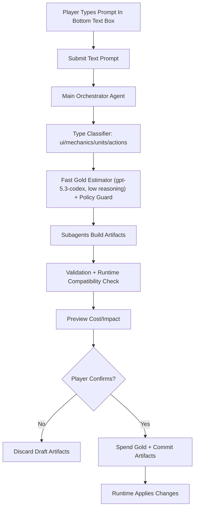

# God Loop Prompt System Design

**Date**: 2026-02-28
**Author**: Aaron + Codex
**Status**: Draft
**Category**: Architecture

## Executive Summary

Define a prompt-first game architecture where the player acts as "God" and spends Gold to manifest new capabilities in four content types:

1. `ui`: Interface additions or improvements.
2. `mechanics`: New game systems and rule behaviors.
3. `units`: Persistent allied entities.
4. `actions`: One-shot effects/spells.

The core game loop remains simple for now: endless goons march downward toward castle walls. The prompt system sits on top of that loop and safely extends gameplay without hand-authoring every feature.

## Locked Decisions

- Engine: PixiJS is the primary runtime/rendering engine.
- Prompt input: text-only via bottom-screen text box.
- Artifact mutability: players cannot directly edit generated artifacts.
- Concurrency policy: no hard cap on concurrent mechanics.
- Precedence policy: latest successful prompt always overrides prior conflicting behavior.
- Economy policy: Gold is earned at a flat kill reward, with optional mechanic-based modifiers.
- Economy constants: starting Gold is 1,000,000 and default reward is 10 Gold per goon kill.
- Cost estimation: use a fast model pass with GPT (`gpt-5.3-codex`, reasoning effort `low`).
- Apply semantics: all-or-nothing apply, retry up to 5 times, full Gold refund on terminal failure.
- Queueing: prompts are processed strictly one-at-a-time.
- Simulation mode: world simulation continues running while prompt apply is in progress.
- Retry policy: fixed delay between retries (not exponential).
- Latency target: allow long workflows; initial p95 end-to-end apply target is 30 seconds.
- Safety scope now: no additional content/abuse guardrail layer in v1.
- History model: replayable prompt script history, no branching checkpoints.
- Asset generation provider: fal `nano-banana-2` endpoint for 2D asset generation.
- Model preset tiers: `fast`, `medium`, `high` with team-managed model mappings.

## User Personas & Context

- **Primary user**: Designer-player controlling game evolution in real time.
- **Immediate need**: Fast experimentation with prompt-to-game outcomes.
- **Constraint**: Resource-limited creation (Gold) and bounded implementation safety.

## Core Requirements

### Functional Requirements

#### FR1: Persistent Prompt Bar
- **Description**: A bottom-screen text box is always available for prompt submission.
- **Acceptance Criteria**:
  - Text box is anchored at the bottom of the screen.
  - Player can type and submit prompts at any time during gameplay.

#### FR2: Four-Type Prompt Classification
- **Description**: Every prompt is classified into one or more of `ui`, `mechanics`, `units`, `actions`.
- **Acceptance Criteria**:
  - Classifier outputs type(s) and confidence.
  - Ambiguous prompts return a safe fallback (`review_required`) instead of silent failure.

#### FR3: Gold-Gated Creation
- **Description**: Prompt execution costs Gold based on estimated complexity and runtime impact.
- **Acceptance Criteria**:
  - Prompt preview shows estimated Gold cost before apply.
  - Execution is blocked when Gold is insufficient.
  - Gold accrues from enemy kills at a flat per-kill value unless modified by mechanics.
  - Run starts with 1,000,000 Gold.

#### FR4: Runtime Artifact Generation
- **Description**: Successful prompts generate structured artifacts consumed by the game runtime.
- **Acceptance Criteria**:
  - `ui` creates UI configs/components.
  - `mechanics` creates rule scripts/event handlers.
  - `units` creates entity definitions/behaviors.
  - `actions` creates castable effect definitions.
  - On conflicts, newest successful artifact version wins over older versions.

#### FR5: Endless Invasion Baseline
- **Description**: Base gameplay runs independently of prompt system.
- **Acceptance Criteria**:
  - Goons spawn continuously and march toward castle.
  - Castle wall HP decreases on contact.
  - Goon HP and death behavior are present.
  - Simulation continues while prompt generation/apply workflows execute.

### Non-Functional Requirements

#### NFR1: Safety & Rollback
- **Description**: New prompt artifacts must be sandboxed and reversible.
- **Target Metric**: 100% of prompt applications are transactionally rollbackable.

#### NFR2: Iteration Latency
- **Description**: Prompt-to-preview should be fast enough for live design.
- **Target Metric**: p95 end-to-end apply under 30 seconds.

#### NFR3: Deterministic Replay
- **Description**: Match state and prompt results should be reproducible from logs.
- **Target Metric**: Same seed + same prompt artifacts yields same battle outcomes.

#### NFR4: Transactional Reliability
- **Description**: Prompt application should never leave partial state.
- **Target Metric**: 100% atomic apply semantics (fully committed or fully rejected/refunded), with up to 5 retries before terminal failure.

## Technical Architecture

### High-Level Flow



### Detailed Design

#### 1) Prompt Envelope Contract

All user prompts are normalized into:

```json
{
  "id": "prompt_123",
  "inputMode": "text",
  "rawPrompt": "spawn 3 plague priests with chain disease",
  "classifiedTypes": ["units", "mechanics"],
  "estimatedGoldCost": 180,
  "riskLevel": "low | medium | high",
  "requiresReview": false
}
```

#### 2) Four Content Type Contracts

- `ui`: HUD, health bars, toolbar, cast buttons, overlays.
  - Output: UI layout/config + optional assets.
- `mechanics`: Damage-over-time, AoE spread, cooldown systems, status effects.
  - Output: Rule modules + event hooks.
- `units`: Persistent entities that can attack, tank, or support.
  - Output: Unit prefab + behavior tree/state machine.
- `actions`: One-time spells/effects (meteor, plague burst, wall repair).
  - Output: Action definition with cast conditions and cooldown.

#### 3) Gold Economy Rules

- Base cost by type:
  - `ui`: 20
  - `actions`: 40
  - `units`: 60
  - `mechanics`: 90
- Initial bankroll:
  - Starting Gold: 1,000,000.
- Gold income:
  - Flat per-goon kill reward: 10.
  - Optional multipliers from active mechanics (for example, bounty auras).
- Complexity multipliers:
  - New art asset required: x1.4
  - New status system required: x1.5
  - Multi-type prompt: +15 flat per additional type
- Runtime budget guard:
  - No hard rejection for mechanic concurrency.
  - Apply prompts with a performance-risk score and runtime telemetry warnings.

#### 4) Cost Estimation Pass

- Use a dedicated fast model request before generation to estimate prompt complexity and Gold cost.
- Initial model: `gpt-5.3-codex` with reasoning effort `low`.
- Estimator output includes:
  - inferred type set
  - complexity score (1-10)
  - estimated Gold
  - rationale tokens (for debug/explainability)

#### 5) Generation Model Presets

- Prompt orchestration should use a runtime-selectable preset:
  - `fast` -> `gpt-5.3-codex` (very fast).
  - `medium` -> `gpt-5.3-codex-medium` (balanced).
  - `high` -> `gpt-5.3-codex-high` (slowest, reasoning-focused).
- Model IDs are treated as configuration mappings so they can be swapped without code changes.
- Cost estimation remains a dedicated fast GPT pass independent of preset tier.

#### 6) Agent Topology

- **Main Orchestrator Agent**
  - Parses prompt envelope, triggers subagents, assembles final patch.
- **UI Subagent**
  - Generates HUD/widgets and binds actions to controls.
- **Mechanics Subagent**
  - Creates/modifies gameplay rules and event-driven systems.
- **Units Subagent**
  - Produces persistent unit definitions + combat behavior.
- **Assets Subagent**
  - Produces/collects 2D art and animation references.
- **Validation Subagent**
  - Lints artifacts, checks schema compatibility, enforces safety.

#### 7) Runtime Integration

- Artifact registry stores versioned prompt outputs.
- Prompt processing queue is single-flight (exactly one active prompt at a time).
- Apply flow uses transactions:
  1. Stage artifacts.
  2. Validate.
  3. Attempt apply (max 5 retries, idempotent).
  4. Spend Gold only on successful commit.
  5. Commit and reload relevant systems.
- On terminal failure: rollback registry + full Gold refund.
- Conflict resolution: latest successful prompt overwrites conflicting prior definitions.
- Retry interval uses fixed delay between attempts.
- The battle simulation loop continues running during queue wait, generation, and apply.

#### 8) Unit and Action Lifetime Model (v1)

- `actions`: one-shot effects that resolve immediately or over a bounded duration.
- `units`: persistent by default until killed/despawned.
- Optional unit lifetimes:
  - `timed`: auto-despawn after duration.
  - `wave`: despawn when current wave transitions.
- If a newer prompt redefines a currently active unit/action/mechanic signature, the new definition replaces old behavior at next deterministic sync tick.

## Implementation Plan

### Phase 1: Baseline Game Loop (2-3 days)
- [ ] Spawn endless goons moving downward.
- [ ] Add castle wall HP and collision damage.
- [ ] Add unit/goon HP and death handling.
- [ ] Add in-game Gold resource display.

### Phase 2: Prompt Shell + Bottom Prompt Bar UX (2 days)
- [ ] Add persistent bottom text box prompt panel.
- [ ] Add prompt envelope schema and persistence.
- [ ] Add cost preview and confirm/cancel flow.

### Phase 3: Four-Type Pipeline + Subagents (4-6 days)
- [ ] Implement type classifier with confidence thresholds.
- [ ] Implement single-flight prompt queue and queue status UI.
- [ ] Implement per-type artifact builders.
- [ ] Implement orchestrator + validation + rollback.

### Phase 4: Scriptable Mechanics Layer (4 days)
- [ ] Add event bus (`onSpawn`, `onHit`, `onDeath`, `onTick`).
- [ ] Add status effect model (DoT, AoE spread, buffs/debuffs).
- [ ] Add action casting and cooldown model.

### Phase 5: Tooling + Observability (2 days)
- [ ] Prompt history panel with artifact versions.
- [ ] Prompt script export/import for deterministic replay.
- [ ] Gold spend analytics by type.
- [ ] Deterministic replay logs.

## Testing Strategy

### Unit Tests
- Type classification and fallback behavior.
- Gold estimation determinism.
- Unit/action/mechanic schema validation.

### Integration Tests
- Prompt bar end-to-end (submit -> preview -> apply -> runtime effect).
- Rollback and refund on failed apply.
- Multi-type prompt with shared dependencies.

### Performance Tests
- Spawn stress with baseline + 20 active units.
- Mechanics stress with stacked status effects.
- p95 latency for preview/apply.

## Success Metrics

- 80%+ prompts map correctly to at least one intended type.
- 0 unrecoverable runtime crashes from prompt artifacts.
- 95% of successful applies reflected in gameplay within 30 seconds.
- Average 3+ meaningful prompt iterations per play session.

## Risk Assessment

| Risk | Impact | Likelihood | Mitigation |
|------|--------|------------|------------|
| Prompt ambiguity leads to wrong type | High | Medium | Confidence threshold + review_required fallback |
| Runtime instability from generated mechanics | High | Medium | Strict schema + validation subagent + rollback |
| Gold costs feel unfair | Medium | Medium | Expose cost breakdown + tune multipliers |
| Asset generation latency blocks flow | Medium | High | Allow placeholder assets and async asset swaps |
| Retry storms on failed applies | Medium | Medium | Cap retries at 5 with idempotency keys and fixed-delay retries |
| Queue bottlenecks with long prompts | Medium | High | Queue status UX + preset selection (`fast`/`medium`/`high`) |

## Open Questions

None for v1. Reassess after first playable milestone.

## Dependencies

- Core game loop runtime and entity system.
- Event bus for combat and status effects.
- Schema validation layer for generated artifacts.
- Asset generation backend via fal `nano-banana-2` endpoint.

## Conclusion

This design keeps your "Playing God" fantasy intact while constraining chaos with type contracts, Gold gating, and agentized generation. It is intentionally minimal at first, but structured so new prompt types and richer subagents can be introduced without refactoring the entire game loop.
